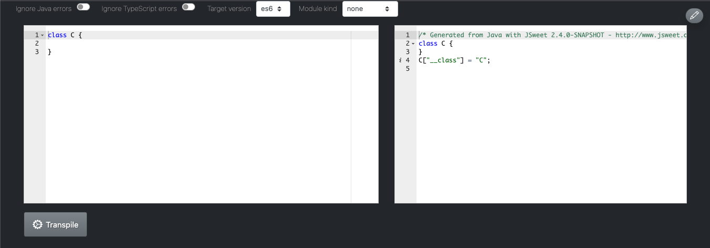

# JSweet HTTP Server

This project provides light HTTP server with a JSON Rest Web API to run the [JSweet transpiler](https://github.com/cincheo/jsweet) from any client, without having to install JSweet locally.

The server is built with [NanoHttpd](https://github.com/NanoHttpd/nanohttpd).

It comes also with a small JSweet client, which is the JSweet sandbox. You can try it live at http://www.jsweet.org/jsweet-live-sandbox/. 

## How to use

To transpile a file from Java to TypeScript or JavaScript, one must invoke the ``transpile`` REST endpoint on the JSweet server.

- base url: http://localhost:8580 (for local installation)
- path: transpile
- method: POST
- body (form data) (see JSweet documentation of a complete list of values to be passed)
```json
{
    "javaCode": ...,
    "tid": <unique uuid>,
    "tsout": false/true,
    "ignoreJavaErrors": false/true,
    "ignoreTypeScriptErrors": false/true,
    "targetVersion": es6/...,
    "moduleKind": none/commonjs/...
}
``` 

# Build and run the server (for JSweet v2.4 and JDK 8)

PREREQUISITE 1: for the JSweet transpiler to work, you will need to make sure that Node.js is installed on the server. For more information, go to https://github.com/cincheo/jsweet

PREREQUISITE 2: make sure you are using the right JDK version, not a JRE (JDK 8 for JSweet < v3) and that your JAVA_HOME env variable points to it (${JAVA_HOME}/lib/tools.jar must exist)

To compile the server, use Maven in the project's directory:

```
> mvn clean install
```

To run the service under Unix-based OS (would need to be adapted for other OS):

```
> java -cp ${JAVA_HOME}/lib/tools.jar:target/jsweet-server.jar org.jsweet.webapi.ServerLauncher
```

# Extend the server with your own libs / classes

In order to compile Java source code that uses external libs without Java compile-time errors, you can add dependencies in your ``pom.xml``. Your can also simple add source code in the ``src/main/java`` directory of the server.

Note that the TypeScript to JavaScript transpilation step will fail if you don't have the right TypeScript definition files. 
In order to avoid failure to generate JavaScript without the appropriate TypeScript definitions, you should switch the ``ignoreTypeScriptErrors`` option to true.

# Use the DLite UI to call the server

In order to test that your compilation server works fine, you can use the simple DLite UI, which is provided within this project.



To use the UI on a local server, follow the steps:

- Make sure that you server is started locally
- Go to https://plateform.dlite.io
- Click on "Upload project file"
- Select the ``www/jsweet-sandbox.dlite`` file
- Type in / paste Java code on the left and click the ``Transpile`` button

To plug the UI to another server, edit the DLite project and change the address of the HTTP connector.

```
